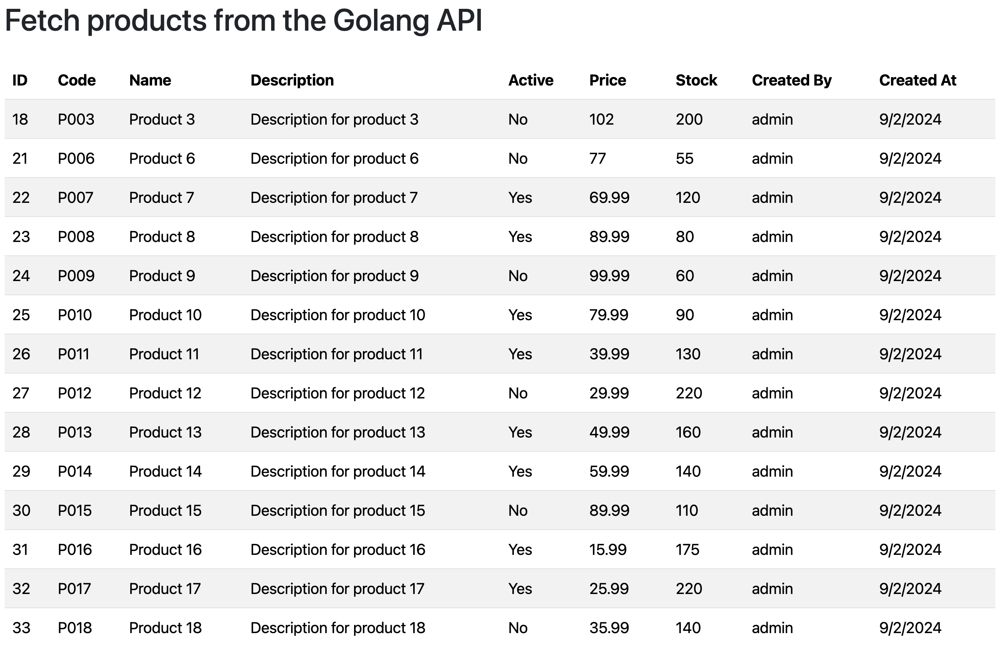

## Fetch products from the Golang API with `extraReducers` and `createAsyncThunk` 

1) Run the Golang API, open a terminal in the project directory.
   ```
   go run .
   ```
2) Run the React app, go to the React project directory and navigate to http://          localhost:3000.
     ```bash
     npm start
     ```
     
