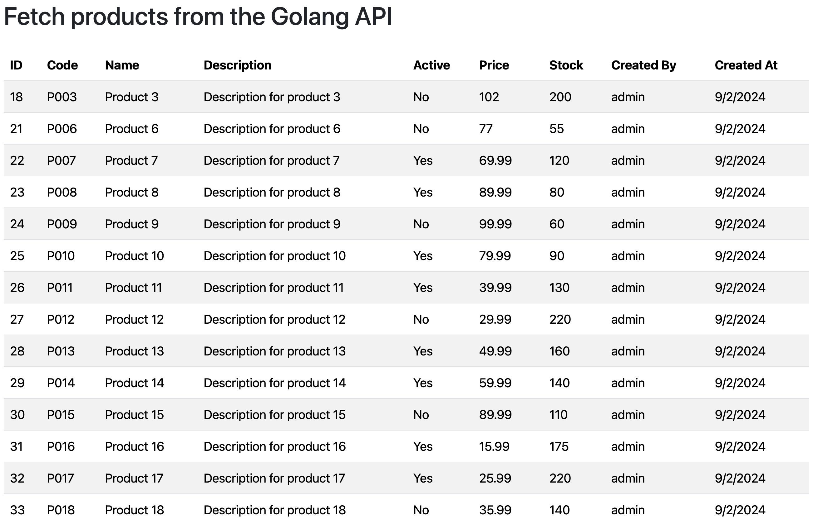

## Redux Toolkit with `extraReducers` and `createAsyncThunk` 

1) Create a React App:
   ```
   npm react-create-app react-rtk-async-thunk
   ```
2) Once the setup is complete, go to into the project directory:
   ```
   cd react-rtk-async-thunk
   ```
3) Install the latest version of Bootstrap:
   ```
   npm install bootstrap
   ```
   and configure the Bootstrap in the index.js file.
   ```
   import "bootstrap/dist/css/bootstrap.min.css";
   ```
4) Create fetchProducts.js, productSlice.js and store.js file.
   [fetchProducts.js]
   ```
   import { createAsyncThunk } from '@reduxjs/toolkit';
   import axios from 'axios';

   const API_URL = 'http://localhost:8083/api/v1/products';

   // Fetch products from the API
   export const fetchProductsFromAPI = createAsyncThunk(
   'product/fetchProductsFromAPI',
   async () => {
      const response = await axios.get(API_URL);
      return response.data; // Return product data from the API
   }
   );
   ```
   [productSlice.js]
   ```
   import { createSlice } from '@reduxjs/toolkit';
   import { fetchProductsFromAPI } from './fetchProducts';

   const initialState = [];
   const productSlice = createSlice({
      name: "product",
      initialState: { products: initialState },
      loading: false,
      error: null,
      reducers: {},
      extraReducers: (builder) => {
            builder.addCase(fetchProductsFromAPI.pending, (state) => {
                  state.loading = true;
                  state.error = null;
            }).addCase(fetchProductsFromAPI.fulfilled, (state, action) => {
                  state.loading = false;
                  state.products = action.payload;
            }).addCase(fetchProductsFromAPI.rejected, (state, action) => {
                  state.loading = false;
                  state.error = action.error.message;
            });
      }
   });
   export default productSlice;
   ```

   [store.js]
   ```
   import { configureStore } from '@reduxjs/toolkit';      
   import productSlice from "./productSlice"

   const store = configureStore({
   reducer: {
      product: productSlice.reducer
   }
   });
   export default store;
   ```
5) Create a directory named "components" and create 2 files as follows:
   `ProductComponent.js`, `ProductList.js`,
   Import the ProductComponent.js into the index.js file:
     [ProductComponent.js]
     ```
     import React, { useEffect } from "react";
     import { useDispatch, useSelector } from "react-redux";
     import { fetchProducts } from "../rtk/fetchProducts";
     import ProductList from "../components/ProductList";

     const ProductComponent = () => {
     const dispatch = useDispatch();
     const { products, loading, error } = useSelector((state) => state.product);

     useEffect(() => {
      // Dispatch the async thunk to fetch product data
      dispatch(fetchProducts());
     }, [dispatch]);

      if (loading) return <p>Loading products...</p>;
      if (error) return <p>Error: {error}</p>;

      return (
         <div className="container mt-5">
            <h2 className="mb-4">Fetch product from a JSON file.</h2>
            <ProductList products={products}/>
         </div>
      );
      };
      export default ProductComponent;
     ```

     [ProductList.js]
     ```
      import React from "react";

      const ProductList = ({ products }) => {
      return (
         <table className="table table-striped">
            <thead>
            <tr>
               <th scope="col">ID</th>
               <th scope="col">Code</th>
               <th scope="col">Name</th>
               <th scope="col">Description</th>
               <th scope="col">Active</th>
               <th scope="col">Price</th>
               <th scope="col">Stock</th>
               <th scope="col">Created By</th>
               <th scope="col">Created At</th>
            </tr>
            </thead>
            <tbody>
            {products.map((product) => (
               <tr key={product.id}>
                  <td>{product.id}</td>
                  <td>{product.code}</td>
                  <td>{product.name}</td>
                  <td>{product.description}</td>
                  <td>{product.active ? 'Yes' : 'No'}</td>
                  <td>{product.price}</td>
                  <td>{product.stock}</td>
                  <td>{product.created_by}</td>
                  <td>{new Date(product.created_at).toLocaleDateString()}</td>
               </tr>
            ))}
            </tbody>
         </table>
      );
      };

      export default ProductList;
      ```

     ```
     [index.js]
     import ProductComponent from './components/ProductComponent';

     const root = ReactDOM.createRoot(document.getElementById('root'));
     root.render(
       <React.StrictMode>
          <ProductComponent />
       </React.StrictMode>
     );
     ```
6) Run the App in Development Mode: Start the app and navigate to http://localhost:3000:
     ```bash
     npm start
     ```
     
